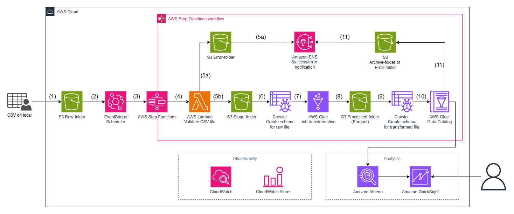

# Architecture Documentation
## ShopMart Sales Data Pipeline on AWS

---

# Part 1: Architecture Design

## Task 1.1: Architecture Diagram

### Architecture Overview

The ShopMart Sales Data Pipeline is a fully automated, event-driven data processing system built on AWS. It replaces the manual Excel-based workflow previously performed by the Business Intelligence team — reducing daily processing time from 3–4 hours to near real-time.

The pipeline ingests raw CSV sales files uploaded by 50 stores each morning, validates and transforms the data, stores results in an analytics-optimized format, and exposes them to BI tools for querying and visualization. The entire orchestration is managed by AWS Step Functions, ensuring reliable sequencing, error handling, and observability across all stages.

**Key design principles:**
- Event-driven ingestion triggered automatically on file upload
- Separation of raw, staged, processed, and error data at the storage layer
- Centralized orchestration via Step Functions for auditability and retry logic
- Schema cataloging via AWS Glue for Athena compatibility
- Observability through CloudWatch metrics, alarms, and SNS alerting

---

### AWS Services Used

| Service | Purpose |
|---|---|
| **Amazon S3** | Multi-stage object storage: raw ingestion, staging, processed output, error isolation, and archiving |
| **Amazon EventBridge Scheduler** | Triggers the Step Functions workflow on a scheduled basis aligned with the store upload window (6:00–8:00 AM daily) |
| **AWS Step Functions** | Orchestrates the end-to-end pipeline workflow — sequencing Lambda, Glue, and Crawler steps with built-in error handling and retry |
| **AWS Lambda** | Validates CSV file schema and data quality before processing; routes files to stage or error folder |
| **AWS Glue (ETL Job)** | Performs data transformation: deduplication, null handling, `line_revenue` computation, and aggregation |
| **AWS Glue Crawler** | Automatically infers and registers schema for both raw and transformed datasets into the Glue Data Catalog |
| **AWS Glue Data Catalog** | Central metadata repository enabling Athena to query processed Parquet data without manual schema definition |
| **Amazon SNS** | Sends success/error notifications to the BI team when pipeline completes or encounters critical failures |
| **Amazon Athena** | Serverless SQL query engine over processed Parquet data in S3; used by analysts and BI tools |
| **Amazon QuickSight** | BI visualization layer connecting to Athena for dashboards on daily revenue, top products, and payment metrics |
| **Amazon CloudWatch** | Collects logs and metrics from Lambda, Glue, and Step Functions for operational monitoring |
| **CloudWatch Alarms** | Triggers alerts on anomalies such as job failures, high error rates, or missing file uploads |

---

### Data Flow

**1. Ingestion**

1. Store staff upload CSV files from local systems to **S3 Raw-folder** following the naming convention `store_{store_id}_{YYYYMMDD}.csv`.
2. **EventBridge Scheduler** fires at the configured time window (post 8:00 AM) to trigger the **AWS Step Functions** workflow, ensuring all store files have been uploaded before processing begins.
3. Step Functions initiates the pipeline orchestration.

**2. Validation & Staging**

4. **AWS Lambda** is invoked to validate each CSV file — checking schema correctness (required columns, data types), detecting missing values, duplicate `order_id` entries, and negative quantities.
5. Based on validation outcome:
   - **(5a)** Files with critical schema errors are moved to **S3 Error-folder** and an **Amazon SNS** notification is sent to alert the BI team.
   - **(5b)** Files passing validation are moved to **S3 Stage-folder** for downstream processing.

**3. Processing**

6. **AWS Glue Crawler** scans the Stage-folder and creates/updates the schema for raw files in the **Glue Data Catalog**.
7. **AWS Glue ETL Job** reads staged data and performs:
   - Removal of duplicate records
   - Handling of missing values (null imputation or rejection)
   - Computation of `line_revenue = quantity × unit_price`
   - Aggregation of daily revenue, orders per customer, and payment success rate
   - Separation of clean records from bad records
8. Clean transformed data is written to **S3 Processed-folder** in **Parquet format** (columnar, compressed — optimized for Athena queries), partitioned by date using the path structure `processed/year=YYYY/month=MM/day=DD/`. This enables Athena partition pruning — queries scoped to a specific date range scan only the relevant partitions, reducing both query latency and cost.

**4. Storage & Cataloging**

9. A second **AWS Glue Crawler** scans the Processed-folder and registers the transformed schema in the **Glue Data Catalog**.
10. The **Glue Data Catalog** makes the processed dataset queryable via Athena without manual DDL.
11. After pipeline completion, **all files are moved out of the Raw-folder** — leaving it empty and ready for the next day's uploads:
   - Files that passed validation and were successfully processed → moved to **S3 Archive-folder**
   - Files that failed validation → moved to **S3 Error-folder**

   SNS sends a final pipeline status notification. The Raw-folder will be empty after each run, ensuring no file is accidentally reprocessed on the next scheduled execution.

**5. Consumption**

- **Amazon Athena** queries the Parquet data in S3 Processed-folder using the Glue Data Catalog schema — enabling ad-hoc SQL analysis by the BI team.
- **Amazon QuickSight** connects to Athena as a data source to render dashboards: daily revenue trends, top-selling products, payment success rates per store.

**6. Observability**

- **CloudWatch** aggregates logs from Lambda (validation errors), Glue (job metrics), and Step Functions (execution history).
- **CloudWatch Alarms** monitor for job failures, elevated bad-record rates, and missing file uploads — triggering SNS alerts to the operations team.

---

## Task 1.2: Architecture Decision Records (ADRs)

---

### ADR-1: Use Amazon EventBridge Scheduler for Daily Pipeline Trigger

**Context:**
The pipeline must be triggered automatically once all 50 stores have completed their file uploads. The upload window is 6:00–8:00 AM daily. Triggering too early risks processing incomplete data; triggering on each individual file upload would cause 50 separate pipeline executions per day, increasing cost and complexity. A single, time-based trigger post-upload window is the most reliable approach.

**Decision:**
Use **Amazon EventBridge Scheduler** to trigger the AWS Step Functions execution once daily at a fixed time after the upload window closes (e.g., 8:15 AM). This ensures all store files are present in S3 Raw-folder before the pipeline begins, and consolidates processing into a single daily execution.

**Alternatives Considered:**
- **S3 Event Notification → Lambda trigger on each upload:** Would fire 50 times per day (once per file), creating 50 independent pipeline runs. Difficult to coordinate aggregation across all stores and increases Step Functions execution costs.
- **Amazon EventBridge Rules (event-based):** Can react to S3 PutObject events but requires additional logic to determine when all 50 files have arrived — adding complexity without clear benefit over a scheduled approach.
- **AWS Lambda scheduled via CloudWatch Events (legacy):** Functionally equivalent but EventBridge Scheduler is the modern replacement with better timezone support, flexible scheduling expressions, and built-in retry on failed invocations.

**Consequences:**
- Simple, predictable trigger with no dependency on individual file arrival events.
- If a store uploads late (after 8:00 AM), their file will be missed in the scheduled run — requires a manual re-trigger or a separate late-file handling process.
- EventBridge Scheduler supports timezone-aware cron expressions, making it straightforward to align with local business hours.
- Failed invocations (e.g., IAM permission issues) are retried automatically by EventBridge Scheduler and logged to CloudWatch.

---

### ADR-2: Store Processed Data in Parquet Format on S3

**Context:**
The BI team needs to run analytical queries (daily revenue, top products, payment success rate) over data accumulated from 50 stores. The output format must be compatible with Athena and QuickSight, and must support efficient querying without full table scans.

**Decision:**
Write all processed output to **Amazon S3 in Apache Parquet format**, partitioned by `order_date` and `store_id`. Register the schema in **AWS Glue Data Catalog** for Athena access.

**Alternatives Considered:**
- **CSV in S3:** Human-readable but inefficient for analytical queries — no columnar compression, no predicate pushdown. Athena costs scale with data scanned.
- **Amazon RDS / Aurora:** Relational databases support SQL queries but are not cost-effective for append-only analytical workloads. Requires schema management and ongoing instance costs.
- **Amazon Redshift:** Excellent for large-scale analytics but introduces significant infrastructure overhead and cost for a dataset of this size (~50 files × 5,000 rows/day).

**Consequences:**
- Parquet's columnar compression reduces S3 storage costs and Athena query costs significantly.
- Partitioning by date and store enables partition pruning — queries scoped to a date range avoid scanning the full dataset.
- Requires Glue Crawler to maintain schema registration; adds a step to the pipeline but is fully automated.
- Parquet is not human-readable — raw/error files are retained in CSV for manual inspection if needed.

---

### ADR-3: Use AWS Lambda for CSV Validation Before ETL

**Context:**
<cite index="1-5">Input files may contain data quality issues including missing values, duplicates, and negative quantities.</cite> Running a full Glue ETL job on a malformed or structurally invalid file wastes compute resources and produces misleading partial outputs. Validation must be fast, cheap, and capable of routing bad files before they enter the transformation stage.

**Decision:**
Use a dedicated **AWS Lambda function** as the first processing step to validate each CSV file's schema (column names, data types, row count sanity) and flag critical quality issues. Lambda routes files to either the Stage-folder (pass) or Error-folder (fail) and triggers SNS notification on critical failures.

**Alternatives Considered:**
- **Validate inside the Glue Job:** Possible, but Glue has a minimum billing duration (~1 minute DPU) and a cold start overhead. Using Glue for lightweight validation is cost-inefficient.
- **AWS Glue DataBrew:** Provides visual data quality rules but adds cost per node-hour and is less flexible for custom validation logic (e.g., checking filename convention, store ID format).
- **No pre-validation (validate in Glue only):** Risks propagating bad data into the processed layer if Glue error handling is misconfigured. Harder to isolate the root cause of failures.

**Consequences:**
- Lambda provides sub-second validation at minimal cost (~$0.0000002 per invocation).
- Clear separation of concerns: Lambda owns validation, Glue owns transformation.
- Lambda has a 15-minute execution limit — sufficient for validating a single CSV file (500–5,000 rows), but not suitable for large-scale transformation.
- Validation logic must be maintained separately from ETL logic; changes to the schema require updates in both Lambda and Glue.

---

## Task 1.3: Failure Scenarios

---

### Scenario 1: CSV File Fails Schema Validation

**What happens?**
A store uploads a CSV file with missing required columns (e.g., `unit_price` is absent), incorrect data types (e.g., `order_date` formatted as `DD/MM/YYYY` instead of `YYYY-MM-DD`), or a malformed header row. The Lambda validation function detects the structural issue.

**How does the system detect it?**
The Lambda function checks for required column presence, data type conformance, and basic row integrity on every file before it proceeds to staging. If validation fails, the function returns a failure status to Step Functions.

**Recovery strategy:**
Step Functions transitions to the error branch: the file is moved from Raw-folder to S3 Error-folder with a timestamped error log. The pipeline continues processing remaining valid files. The store is expected to re-upload a corrected file; the pipeline can be re-triggered manually or on the next scheduled run.

**Who needs to be notified?**
- **BI / Data Engineering team** via SNS email/SMS alert with the filename, store ID, and error description.
- Optionally, the store operations team if a store-level notification channel is configured.

---

### Scenario 2: AWS Glue ETL Job Failure

**What happens?**
The Glue ETL job encounters an unhandled exception during transformation — for example, a data type casting error on an edge-case record, an out-of-memory condition on an unusually large file batch, or a transient AWS service error.

**How does the system detect it?**
Step Functions monitors the Glue job execution status. If the job transitions to `FAILED` or `TIMEOUT` state, Step Functions catches the error via its `Catch` block and transitions to the failure handling state. CloudWatch Logs captures the full Glue job error output.

**Recovery strategy:**
Step Functions retries the Glue job up to a configured number of attempts (e.g., 2 retries with exponential backoff) before marking the execution as failed. On final failure, the staged files are moved to S3 Error-folder and an SNS alert is sent. The Data Engineering team investigates CloudWatch Logs, fixes the root cause, and re-runs the Step Functions execution manually for the affected date partition.

**Who needs to be notified?**
- **Data Engineering team** via SNS alert with execution ARN, job name, error message, and affected date.
- **BI team** if the failure means daily metrics will not be available by the expected time.

---

### Scenario 3: Missing or Delayed File Upload from a Store

**What happens?**
One or more stores fail to upload their CSV file within the expected window (6:00–8:00 AM). This could be due to network issues at the store, a local system failure, or human error. When the pipeline runs, it processes only the files present — silently omitting the missing store's data from daily aggregations.

**How does the system detect it?**
A CloudWatch Alarm or a post-pipeline Lambda check compares the number of files processed against the expected count (50 stores). If the count is below threshold (e.g., fewer than 45 files), the alarm triggers. Alternatively, a file presence check can be embedded as a Step Functions state that validates expected store IDs before proceeding.

**Recovery strategy:**
The pipeline proceeds with available files and completes normally. The missing store's data is flagged in the processing summary log. Once the store uploads the delayed file (outside the normal window), a manual or on-demand Step Functions execution can be triggered to process the late file and update the aggregations for that date partition.

**Who needs to be notified?**
- **BI team** via SNS alert listing the missing store IDs so they are aware that daily totals are incomplete.
- **Store operations / IT team** for the affected store(s) to investigate the upload failure.

---

### Scenario 4: S3 Event / EventBridge Trigger Failure

**What happens?**
The EventBridge Scheduler fails to trigger the Step Functions execution — due to a misconfigured schedule rule, an IAM permission issue on the EventBridge-to-StepFunctions role, or a transient AWS service disruption. The pipeline does not run despite files being present in the Raw-folder.

**How does the system detect it?**
CloudWatch Metrics for Step Functions will show zero executions started for the expected time window. A CloudWatch Alarm on `ExecutionsStarted` count below 1 within the scheduled window will fire. EventBridge also emits failed invocation events to CloudWatch Logs.

**Recovery strategy:**
The Data Engineering team is alerted and manually triggers the Step Functions execution via the AWS Console or CLI, pointing it at the files already present in the Raw-folder. The root cause (IAM policy, schedule expression) is corrected and the schedule is re-enabled. No data is lost as files remain in S3.

**Who needs to be notified?**
- **Data Engineering team** via CloudWatch Alarm → SNS for immediate investigation.
- **BI team** if the delay impacts the availability of daily reports.

---

### Scenario 5: Athena Query Failure Due to Schema Mismatch

**What happens?**
A change in the upstream CSV format (e.g., a new column added, a column renamed) causes the Glue Crawler to update the schema in the Data Catalog in a way that is incompatible with existing Athena saved queries or QuickSight datasets. Athena queries begin returning errors or incorrect results.

**How does the system detect it?**
Athena query failures are logged in CloudWatch. QuickSight dataset refresh failures surface in the QuickSight console. A post-pipeline validation step (optional Lambda) can run a smoke-test Athena query after each pipeline execution and alert on failure.

**Recovery strategy:**
The Data Engineering team reviews the Glue Data Catalog for schema drift, rolls back to the previous table version if needed (Glue supports schema versioning), and coordinates with store operations to enforce the canonical CSV schema. Athena table definitions are updated to accommodate the new schema if the change is intentional.

**Who needs to be notified?**
- **Data Engineering team** via CloudWatch Alarm or post-pipeline validation alert.
- **BI team** to pause report distribution until schema consistency is restored.
